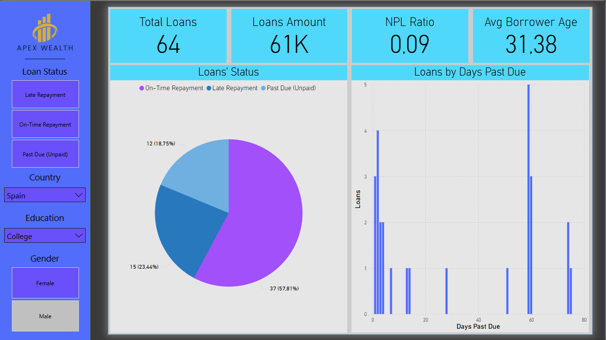
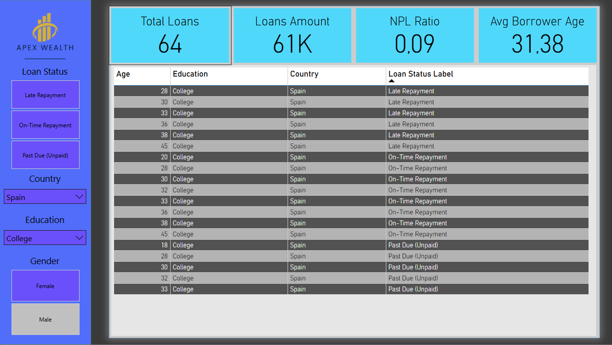

# Loan Portfolio Risk Analysis Dashboard

## 📌 Project Overview
This project presents an exploratory analysis and an interactive dashboard
focused on loan performance and credit risk assessment.

The objective is to analyze:
- Loan repayment behavior
- Delinquency and recovery patterns
- Risk distribution across countries and borrower profiles

## 🗄 Data Pipeline & SQL Analysis
The analysis is based on a relational database built in **PostgreSQL**.

The workflow includes:
- Importing and cleaning raw loan data using **SQL**
- Data normalization (borrowers and loans separation)
- Creation of analytical **SQL views** for:
  - Loan performance
  - Delinquency analysis
  - Credit risk metrics

The SQL development and database exploration were performed using **DBeaver**.
The final analytical views were then connected directly to **Power BI**.

Note: Some borrower attributes (e.g. country) were synthetically generated
to simulate a realistic relational data model and enable join-based analysis.

## 📊 Dashboard Preview

## 📈 Key Metrics
- Total number of loans
- Non-Performing Loan (NPL) ratio
- Average borrower age
- Total loan amount

## 🔍 Analysis Dimensions
The dashboard allows slicing and filtering by:
- Loan status
- Country
- Education level
- Gender

## 🛠 Tools & Skills
- **PostgreSQL** (database design & querying)
- **SQL** (data cleaning, joins, views, aggregations)
- **DBeaver** (database management)
- **Power BI** (data modeling, DAX, dashboards)
- Credit risk & loan portfolio analysis
- Data visualization & storytelling

## 🧠 Analytical Approach
The project follows a structured analytical workflow:
1. Raw data ingestion and validation
2. Data cleaning and transformation using SQL
3. Relational modeling and joins
4. Creation of reusable analytical views
5. Interactive visualization and insight generation in Power BI

